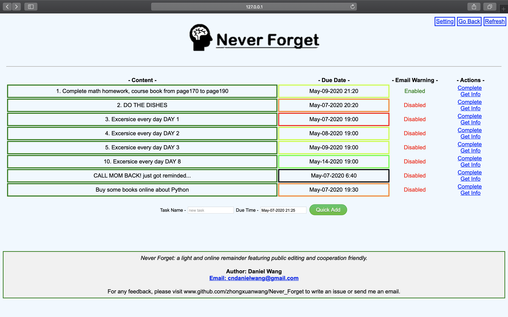
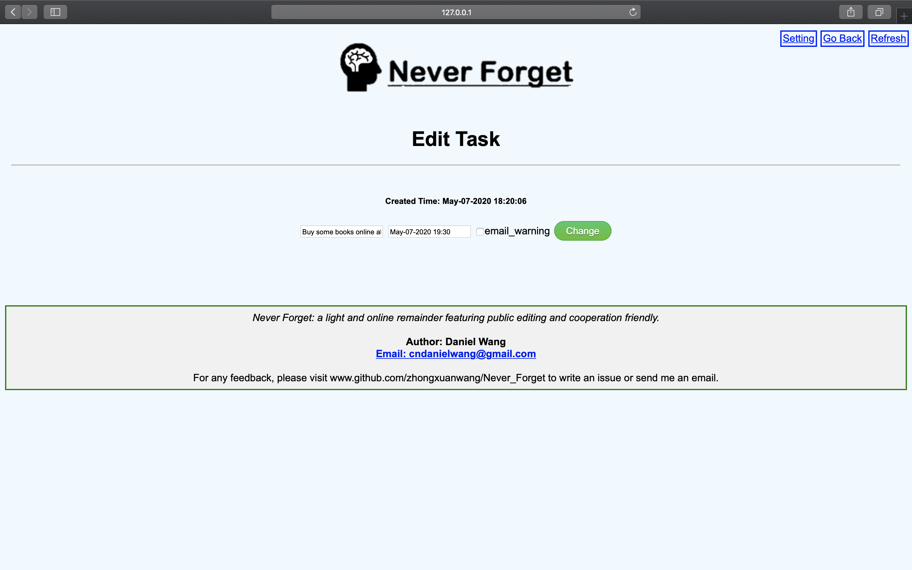

# Never_Forget  

[Click here to download!](https://github.com/ZhongxuanWang/simple_web_remainder-python/archive/master.zip)
## Introduction:

This is online remainder that features using flask, Jinja2, js  and SQLAlchemy. Good source code for beginners, and developers who hope
   to use this as a template for their project.*

## Functions include:

- Send email notifications automatically when one task is pending.
- View how urgent some tasks are by looking at the color of the due date.
- Highly flexible in settings, and info for individual tasks

## Benifits:

- Since it's a really small and light remainder, you can develop your own remainder based on this. The virtual environment is ready,  the time module is ready, the css and html templates are ready...
- You can literally deploy on any devices with any hardware configuration only if it has right version of python and other dependencies.

## How to use?

- Simply install the dependencies, compile the project using the environment, and you are all set!

